# CLAUDE.md

## 变更记录 (Changelog)
- **2025-10-26**: 自适应初始化架构师完成首次全面扫描，生成完整模块文档和架构总览
- **2024-12月**: 增加渠道切换功能，修复页面刷新和按钮定位问题，提升脚本稳定性
- **2024-04-01**: 增加选座购买功能和代理IP池，提高抢票成功率
- **2023-09-15**: 优化抢票算法，支持设置抢票时间段，增强稳定性

## 项目愿景

**damaihelper** 是一个多平台抢票自动化脚本系统，致力于为中文票务平台用户提供高效、稳定的自动化购票解决方案。通过Selenium和Appium技术模拟真实用户操作，支持大麦网、淘票票、缤玩岛等主流平台，提升抢票成功率并改善用户体验。

## 架构总览

项目采用**双架构设计模式**，既有传统的单脚本模式便于快速部署，也有现代化的模块化架构支持复杂场景：

### 核心架构模式

1. **传统单脚本模式** (`ticket_script.py`)
   - 所有功能集成在`Concert`类中
   - 适合快速部署和简单使用场景
   - 配置通过JSON文件或硬编码参数

2. **现代模块化架构** (`scripts/`)
   - 功能拆分为独立模块，便于维护和扩展
   - 支持复杂的多账户、多平台场景
   - 更好的错误处理和日志记录

### 技术栈概览

- **浏览器自动化**: Selenium WebDriver + ChromeDriver
- **移动端模拟**: Appium + Android设备模拟
- **调度系统**: APScheduler定时任务调度
- **验证码识别**: Tesseract OCR + 百度OCR服务
- **用户界面**: Tkinter桌面GUI应用
- **配置管理**: JSON格式配置文件系统
- **代理支持**: HTTP/HTTPS代理IP池轮换

## ✨ 模块结构图

```mermaid
graph TD
    A["(根) damaihelper"] --> B["scripts 现代化模块化组件"];
    A --> C["config 配置管理系统"];
    A --> D["logs 日志记录系统"];
    A --> E["传统架构根模块"];

    B --> F["main.py 统一入口"];
    B --> G["selenium_driver.py 浏览器驱动"];
    B --> H["multi_account_manager.py 多账户管理"];
    B --> I["scheduler.py 定时调度"];
    B --> J["captcha_solver.py 验证码识别"];
    B --> K["appium_simulator.py 移动端模拟"];

    C --> L["config.json 主配置"];
    C --> M["platform_config.json 平台配置"];
    C --> N["proxy_pool.json 代理池"];

    D --> O["error_log.txt 错误日志"];
    D --> P["script_log.txt 运行日志"];

    E --> Q["ticket_script.py 传统单脚本"];
    E --> R["GUI.py 图形界面"];
    E --> S["requirements.txt 依赖管理"];

    click B "./scripts/CLAUDE.md" "查看 scripts 模块文档"
    click C "./config/CLAUDE.md" "查看 config 模块文档"
    click D "./logs/CLAUDE.md" "查看 logs 模块文档"
    click F "./scripts/main.py" "查看 main.py 源码"
    click Q "./ticket_script.py" "查看 ticket_script.py 源码"
    click R "./GUI.py" "查看 GUI.py 源码"
```



## 模块索引

| 模块名称 | 路径 | 主要职责 | 技术栈 | 入口文件 | 覆盖率 |
|---------|------|----------|---------|----------|---------|
| **scripts** | `scripts/` | 现代化模块化抢票组件系统 | Python + Selenium/Appium | `scripts/main.py` | 100% |
| **config** | `config/` | 多平台配置和代理管理 | JSON配置 | `config/config.json` | 67% |
| **logs** | `logs/` | 运行时日志记录系统 | 文本日志 | `logs/` | 100% |
| **root** | `./` | 传统单脚本和GUI界面 | Python/Tkinter | `ticket_script.py` | 30% |

## 支持的票务平台

| 平台 | 状态 | 登录方式 | 代理支持 | 验证码处理 | 配置优先级 |
|------|------|----------|----------|------------|-----------|
| **大麦网** | ✅ 完全支持 | 扫码/短信/密码 | ✅ 支持 | OCR识别 | 高 |
| **淘票票** | ✅ 完全支持 | 短信验证 | ✅ 支持 | 禁用 | 中 |
| **缤玩岛** | ✅ 基本支持 | 扫码登录 | ❌ 不支持 | 手动处理 | 低 |

## 运行与开发

### 环境准备

```bash
# 安装Python依赖
pip install -r requirements.txt

# 检查ChromeDriver版本
chromedriver.exe --version

# Windows一键环境搭建
./win一件运行.bat
```

### 运行方式

```bash
# 1. 传统单脚本方式（核心逻辑）
python ticket_script.py

# 2. 现代模块化方式（推荐）
python scripts/main.py

# 3. 图形界面方式（非技术用户）
python GUI.py
```

### 开发配置

- **驱动路径**: 需要配置ChromeDriver路径（Windows/Linux/Mac版本）
- **Cookie管理**: 首次运行需手动登录，后续自动加载`cookies.pkl`
- **代理设置**: 支持HTTP/HTTPS代理IP池配置
- **定时任务**: 支持cron表达式和时间点配置

## 测试策略

### 当前测试覆盖
- ❌ 单元测试：未发现测试文件
- ❌ 集成测试：未实现自动化测试
- ✅ 手动测试：通过GUI和命令行验证
- ✅ 配置验证：JSON配置文件格式验证

### 建议测试补充
1. **单元测试**: 为核心模块添加pytest测试
2. **配置测试**: 验证各平台配置的有效性
3. **集成测试**: 测试多账户、多平台协同工作
4. **性能测试**: 验证高并发抢票场景

## 编码规范

### Python代码规范
- 使用PEP 8代码风格
- 函数和类需要docstring文档
- 异常处理要有具体错误信息
- 配置文件使用JSON格式，保持向后兼容

### 配置文件规范
- 所有时间格式使用ISO 8601标准
- URL优先使用HTTPS协议
- 敏感信息使用环境变量或加密存储
- 版本控制时忽略包含真实密码的配置

## AI使用指引

### 代码生成建议
1. **新增平台支持**: 参考现有平台配置模板
2. **功能模块开发**: 遵循现有模块的导入导出模式
3. **错误处理**: 使用统一的日志记录格式
4. **配置验证**: 添加JSON Schema验证

### 代码维护重点
- **反检测机制**: 持续更新WebDriver掩码和User-Agent
- **平台适配**: 监控目标平台页面结构变化
- **性能优化**: 优化元素定位和等待策略
- **安全加固**: 加强代理轮换和请求频率控制

## 安全注意事项

### 合规使用
- ✅ 仅用于合法的个人购票需求
- ✅ 遵守平台服务条款和使用政策
- ✅ 避免高频请求导致账户封禁
- ✅ 建议使用代理IP池分散请求

### 技术安全
- 🔄 Cookie定期更新和验证
- 🔄 代理IP池动态轮换
- 🔄 验证码识别服务备份
- 🔄 登录状态异常检测

### 使用限制
- 避免在平台非营业时间高频请求
- 建议为每个账户设置独立的抢票策略
- 实名制账户必须完成预先认证
- 监控平台反爬虫策略更新

---

## 覆盖率报告

**扫描完成时间**: 2025-10-26 20:48:01
**总体覆盖率**: 83% (29/35 文件已扫描)
**模块覆盖率**: 100% (4/4 模块已识别)

### 覆盖缺口
- `config/proxy_pool.json` - 代理池配置未详细分析
- HTML界面文件 - 前端页面结构未深入分析
- 批处理/Shell脚本 - 部署脚本未完整扫描
- 配置文件中的URL有效性 - 需要实际验证

### 下一步建议
1. 优先补扫代理池配置文件，了解IP轮换机制
2. 分析HTML页面文件，了解辅助界面功能
3. 检查部署脚本，完善环境搭建文档
4. 验证各平台配置的URL和参数有效性

---

**注意**: 本文档由自适应初始化架构师生成，内容基于代码静态分析。实际使用时请结合具体运行环境和平台政策进行调整。